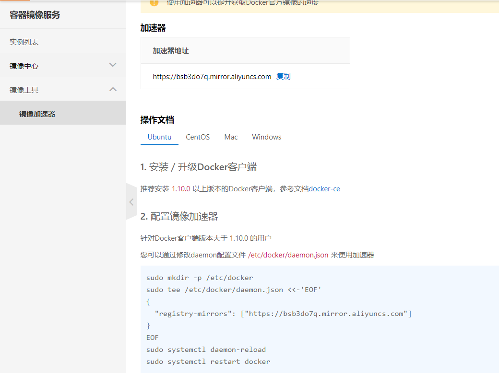
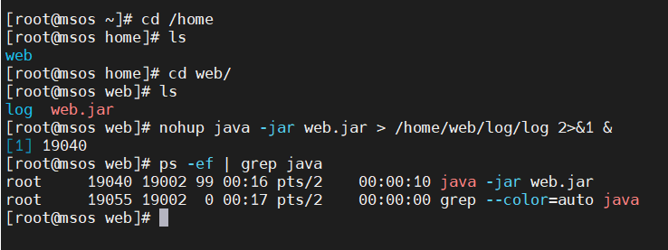

# 环境部署

## 准备工作

```text
JDK >= 1.8 (推荐1.8版本)
Mysql >= 5.7.0 (推荐8.0版本)
Maven >= 3.0
```

## 运行系统

1、前往关于我们页面去到github和gitee下载源码

2、导入到`idea`，菜单 `File` -> `open`，然后选择 `Maven` -> `Existing Maven Projects`，点击 `Next`> 按钮，选择工作目录，然后点击 `Finish` 按钮，即可成功导入。`Eclipse`会自动加载`Maven`依赖包，初次加载会比较慢（根据自身网络情况而定）
      3、不需要创建数据库，直接执行sql文件就可以了

4、打开项目运行`MsosApplication.java`，出现msos表示启动成功。

打开浏览器，输入：([http://localhost:8888 (opens new window)](http://localhost/)) （默认账户/密码 `admin/123456`）
若能正确展示登录后台页面，并能成功登录，菜单及页面展示正常，则表明环境搭建成功

输入`默认账户/密码 `msos/123456登录前台msos首页

建议使用`Git`克隆，因为克隆的方式可以和`RuoYi`随时保持更新同步。使用`Git`命令克隆

```text
git clone 
```

## 必要配置

- 修改数据库连接，编辑`resources`目录下的`application-dev.yml`

```yml
spring:
  datasource:
    username: root #数据库账号
    password: 123456 #数据库密码
    url: jdbc:mysql://1.15.122.167:3306/msos?useUnicode=true&characterEncoding=UTF-8&useSSL=false&serverTimezone=Asia/Shanghai&zeroDateTimeBehavior=CONVERT_TO_NULL #你的本地位置
    driver-class-name: com.mysql.cj.jdbc.Driver
    type: com.alibaba.druid.pool.DruidDataSource
    
    #以下可以改成你自己的，也可以用我的配置
  redis:
    host: 60.205.188.140
    port: 6666

server:
  port: 8888 #服务器端口号

aliyun:
  oss:
    endpoint: oss-cn-chengdu.aliyuncs.com
    accessKeyId: LTAI5t9ycf44Y7zrk1hZJqR7
    accessKeySecret: u8sMnVriJbfDOP1Tf3S0Myj3X1wFEW
    bucketName: msos-dyzz    
```

## 部署系统

- 打包工程文件

在idea里面启动好，使用maven 打包，mvn package 打包Web工程，生成jar包文件。
然后会在项目下生成`target`文件夹包含`jar`包

# 环境准备(jdk、mysql8)

# linux安装jdk

## **查看Linux系统是否有自带的jdk **使用最新版jdk1.8.0_291

```shell
java -version
```

如果系统⾃带有 OpenJDK ，可以按照如下步骤提前卸载之。 ⾸先查找已经安装的 OpenJDK 包： 接下来可以将 java 开头的安装包均卸载即可： 

```shell
rpm -qa | grep java
```

接下来可以将 java 开头的安装包均卸载即可：

```shell
yum -y remove java-1.7.0-openjdk-1.7.0.141-2.6.10.5.el7.x86_64
yum -y remove java-1.8.0-openjdk-1.8.0.131-11.b12.el7.x86_64
```

### 在 /usr/local/ 下创建 java ⽂件夹并进⼊

```shell
cd /usr/local/
```

创建java文件夹放置下载的jdk文件

```shell
mkdir java
```

进入java文件夹

```shell
cd java
```

### 上传你下载的jdk安装包，解压到当前目录

我下载的是jdk-8u291-linux-x64.tar

官网下载地址：[Java SE Development Kit 8 - Downloads (oracle.com)](https://www.oracle.com/java/technologies/javase/javase-jdk8-downloads.html)

上传到java目录

解压到到当前目录

```shell
tar -zxvf jdk-8u291-linux-x64.tar
```

解压后你会得到jdk1.8.0_291目录

我的习惯是删除压缩包jdk-8u291-linux-x64.tar.gz

```shell
rm -rf jdk-8u291-linux-x64.tar.gz
```

### 配置JDK环境变量

> 编辑 /etc/profile ⽂件

```shell
vim /etc/profile  
```

> 在⽂件尾部加⼊如下 JDK 环境配置即可

```shell
JAVA_HOME=/usr/local/java/jdk1.8.0_291CLASSPATH=$JAVA_HOME/lib/PATH=$PATH:$JAVA_HOME/binexport PATH JAVA_HOME CLASSPATH
```

### 刷新环境变量

```shell
source /etc/profile
```

### 输⼊如下命令即可检查安装结果：

```shell
java -versionjavac
```


> 安装jdk步骤就已经完成了


## linux安装docker（阿里云CentOS7.9）

更新yum源

```shell
yum update
```

### 1、卸载旧版本

```shell
sudo yum remove docker \                  docker-client \                  docker-client-latest \                  docker-common \                  docker-latest \                  docker-latest-logrotate \                  docker-logrotate \                  docker-engine
```

第一次安装，如下图：


### 2、安装Docker

安装必要的依赖包设置存储库：

```shell
sudo yum install -y yum-utils
```

```shell
 sudo yum-config-manager \    --add-repo \    https://download.docker.com/linux/centos/docker-ce.repo
```

#### 安装Docker引擎

```shell
sudo yum install docker-ce docker-ce-cli containerd.io
```

#### 启动Docker

```shell
sudo systemctl start docker
```

### 查询Docker安装是否成功

```shell
docker -v
```


### 查看Docker下载的镜像

```shell
sudo docker images
```


### 设置Docker开机自启动

```shell
sudo systemctl enable docker
```

### Docker镜像加速

阿里云镜像源 [传送门](https://cr.console.aliyun.com/cn-hangzhou/instances/mirrors)

登陆后，左侧菜单选中镜像加速器就可以看到你的专属地址了

```shell
$ sudo mkdir -p /etc/docker$ sudo tee /etc/docker/daemon.json <<-'EOF'{  "registry-mirrors": ["专属加速地址"]}EOF$ sudo systemctl daemon-reload$ sudo systemctl restart docker
```

我的镜像加速器是：

```shell
sudo mkdir -p /etc/dockersudo tee /etc/docker/daemon.json <<-'EOF'{  "registry-mirrors": ["https://bsb3do7q.mirror.aliyuncs.com"]}EOFsudo systemctl daemon-reloadsudo systemctl restart docker
```



------

# Linux-Docker安装mysql8.0

第一步：打开docker仓库找到自己要安装的mysql版本

[docker仓库地址](https://hub.docker.com/)

第二步，安装mysql（我选择的是8.0.25）

#### docker拉取下载mysql8.0.25镜像

```shell
docker pull mysql:8.0.25
```


#### 安装mysql

***\*注意：我选择的是mysql 8.0+，数据是区分大小写的，我们要在安装的时候设置不区分大小写，这样处理可以少走很多弯路。\****

```shell
sudo docker run -p 3306:3306 --name mysql8.0 -e MYSQL_ROOT_PASSWORD=123456 -d mysql:8.0.25 --lower_case_table_names=1
```

- -name：容器名，此处命名为mysql8.0
- -e：配置信息，此处配置mysql的root用户的登陆密码
- -p：端口映射，此处映射 主机3306端口 到 容器的3306端口
- -d：后台运行容器，保证在退出终端后容器继续运行（容器名称）
- --lower_case_table_names=1：初始化设置不区分大小写
  

#### 查询mysql 进程

```shell
docker ps -a
```


#### 进入mysql 

```shell
docker exec -it mysql8.0 bash
```

#### 登录msyql

```shell
mysql -uroot -p123456
```

#### 设置远程访问

```shell
ALTER USER 'root'@'%' IDENTIFIED WITH mysql_native_password BY '123456'; flush privileges;
```


用navcat连接msyql


------


>   docker 安装 mysql 8  外部连接会报一下异常： Authentication plugin 'caching_sha2_password' cannot be loaded
>
>   处理办法：
>
>   ① 使用docker进入mysql
>
>   ```shell
>   docker exec -it mysql8.0 bash
>   ```
>
>   
>
>   mysql -uroot -p123456
>   ②修改数据库
>
>   ```
>   ALTER USER 'root'@'%' IDENTIFIED WITH mysql_native_password BY 'root';
>   ```
>
>
>   ③ 重新修改密码
>
>   ````
>   alter  user 'root'@'%' identified by '123456';  ④刷新数据库
>   ````
>
>   ```
>   flush privileges;
>   ```
>
>   

------

#### 导入数据库脚本

登录mysql创建数据库


导入你的sql

阿里云安全组放行你的项目端口号我的是8888

#### 使用jar包方式部署，springboot内嵌tomcat，不用放到tomcat用war包的方式

在idea中，maven

在plugins便签内输入下面的内容，使用maven打包

```xml
<plugin>    <groupId>org.springframework.boot</groupId>    <artifactId>spring-boot-maven-plugin</artifactId></plugin>
```


```shell
mvn cleanmvn package #点击
```

打包好后在target文件夹下可以看到一个jar文件，这个文件便是我们打包好的项目


#### 上传jar包到 /home目录

```shell
cd /home #进入home目录mkdir web #web目录用来放项目源码cd web mkdir log #日志目录touch log.log   #日志文件
```

改名为web.jar

#### 然后在web目录下执行jar文件

```shell
nohup java -jar web.jar > /home/web/log/log 2>&1 &
```

```shell
ps -ef | grep java
```



还需要配置安全组


然后在浏览器地址栏输入ip地址+端口号

访问成功


但是必须有端口号才能访问成功，需要nginx配置一下反向代理直接访问ip，在通过DNS域名解析到ip即可。

访问

msos.club:8888

即可

后续在配置nginx反向代理，配置ssl证书实现https
