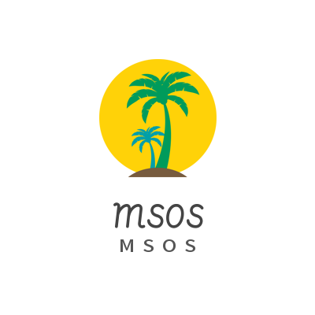

# msos-ui设计

> 负责人，进击的攻城狮成员--曾伟丽

根据现在各种博客框架的兴起，例如，hexo,hugo，wordpress,halo,vuepress等博客框架的查看，决定以hexo,博客框架为主，搭建matery主题风格的msos博客论论坛。

## msos-logo设计

参考

- [免费logo在线制作-字体logo-logo设计-U钙网 (uugai.com)](http://www.uugai.com/)
- [在线LOGO设计；用AI人工智能创建专业公司标志！ - LOGO神器 (logosc.cn)](https://www.logosc.cn/start)
- [【设计模板】免费模板在线设计制作 - 模板素材库 - Canva可画](https://www.canva.cn/templates/?utm_medium=paid&utm_source=baidu&utm_campaign=ACQ-brand-zone&utm_term=canva&utm_content=sem)
- [花瓣网_陪你做生活的设计师（创意灵感天堂，搜索、发现设计灵感、设计素材） (huaban.com)](https://huaban.com/)

## msos-设计图参考

## msos-页面原型设计

### msos首页

### msos-关于页

### msos-留言页

### msos-友链页

### msos-文章页

### msos-注册页

### msos-登录页面

## msos-Axure8原型图源文件

> 还有细节尚未处理，不断完善中